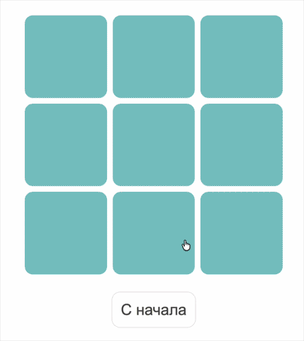

# ❌⭕ Tic-Tac-Toe



Дипломная работа по курсу **«Основы программирования»**.
Реализация логики классической игры **Крестики-нолики** на JavaScript.

🌐 **Демо:**
https://potykalov.github.io/pb-diplom/

---

## 📌 Описание

Игроки по очереди ставят символы:

* ❌ `x`
* ⭕ `o`

Побеждает игрок, который первым заполняет **три клетки подряд**:

* по горизонтали
* по вертикали
* по диагонали

---

## 🛠 Технологии

* HTML
* CSS
* JavaScript (Vanilla JS)
* DOM API

---

## 📂 Структура проекта

```
index.html   — разметка игры  
styles.css   — стили  
ui.js        — отрисовка интерфейса  
logic.js     — логика игры
```

Изменяется только файл **`logic.js`**.

---

## ⚙️ Основная логика

### `startGame()`

Вызывается при загрузке страницы.

Функция:

* создаёт игровое поле `3×3`
* выбирает активного игрока
* вызывает `renderBoard()` для отрисовки.

---

### `click(row, column)`

Вызывается при клике на клетку.

Функция:

1. записывает ход игрока в массив поля
2. обновляет интерфейс через `renderBoard()`
3. проверяет победу
4. вызывает `showWinner()` или передаёт ход следующему игроку

---

## 🧠 Модель игрового поля

Игровое поле хранится в виде **двумерного массива**:

```javascript
let board = [
  ['', '', ''],
  ['', '', ''],
  ['', '', '']
];
```

Игроки:

```javascript
let players = ['x', 'o'];
```

---

## ⭐ Дополнительно

Код написан так, чтобы игру можно было адаптировать под **квадратное поле любого размера (N×N)**.

---

## 👨‍💻 Автор

Учебный проект по программированию.
